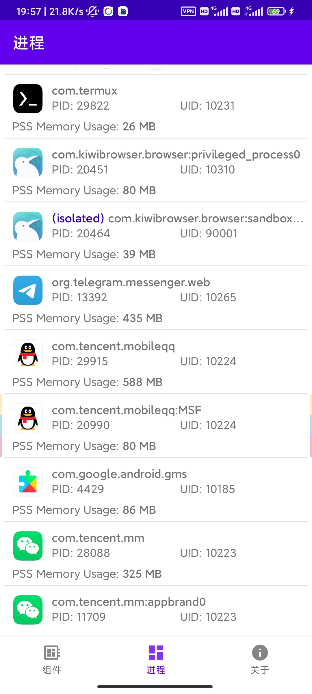

## MyAndroidTools

> 便捷地管理您的 Android 设备

### 简介

与另一款 [MyAndroidTools](https://www.myandroidtools.com/) 一样，本应用使你能够便捷地管理 Android 设备中的应用和组件。但与之不同的是，本应用通过 [Sui](https://github.com/RikkaApps/Sui) 来调用高权限 API，所以不会在使用过程中频繁弹出 root 授权的 Toast 提示

### 功能演示

| 应用列表 | 应用详情 | 组件管理 | 进程查看 |
| :---: | :---: | :---: | :---: |
|  |  |  |  |

### 已知问题

* 偶尔会出现闪退

* 内存占用略高（约 200 MB）

* 目前仅在 Android R 上测试，可能不兼容低版本 Android 设备

### TodoList

- [ ] 应用详情页显示组件数量统计、提取应用图标

- [ ] 修复切换深色模式闪退问题

- [ ] 分离过滤器与 Adapter 
